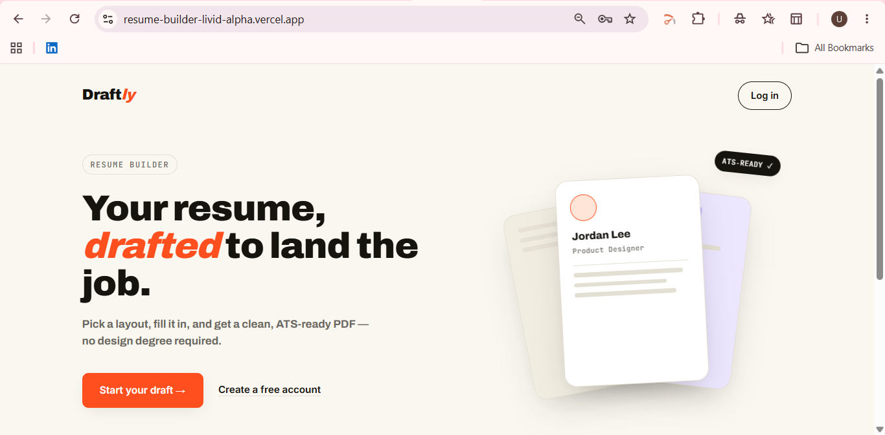
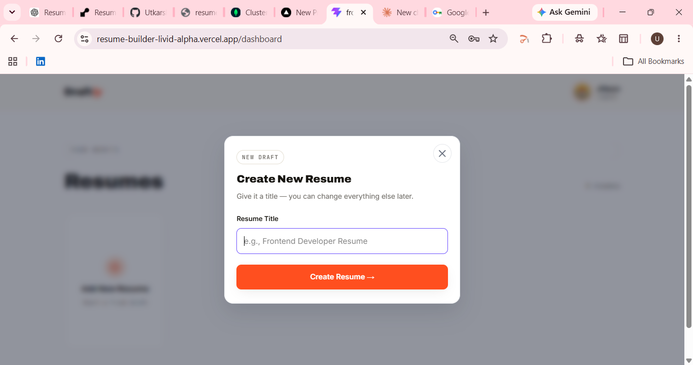
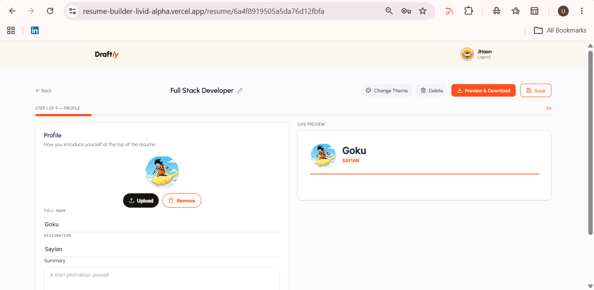
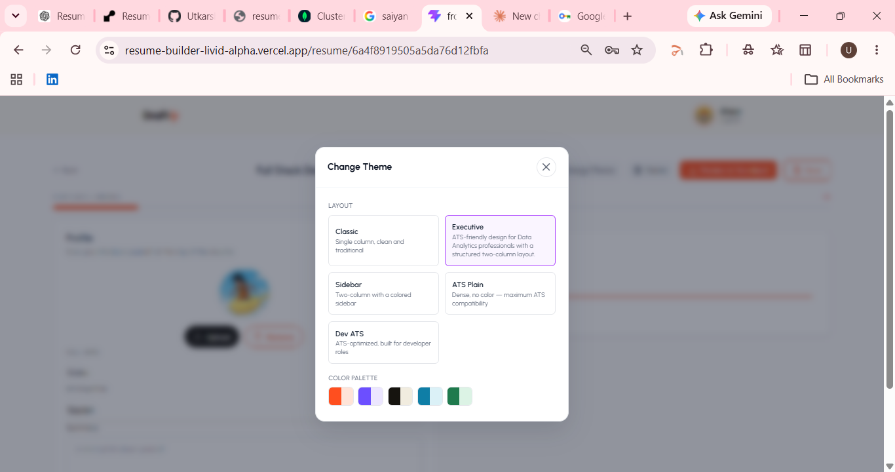

# 🚀 Draftly - Modern Resume Builder

A modern, ATS-friendly Resume Builder built with the MERN Stack that enables users to create, edit, preview, and download professional resumes in real time. Draftly provides multiple modern templates, live editing, image uploads, and PDF export to simplify resume creation for students and professionals.

---

## ✨ Features

- 🔐 JWT Authentication (Register & Login)
- 📄 Create, Edit & Delete Multiple Resumes
- ⚡ Real-Time Resume Preview
- 🎨 Multiple Modern Resume Templates
- 🖼️ Profile Photo Upload
- 📥 High-Quality PDF Download
- 📱 Fully Responsive Design
- 💾 Auto Save Resume Data
- 🎯 ATS-Friendly Resume Layouts
- 🎭 Theme & Color Customization
- 🌐 Deployed on Vercel & Render

---

## 🛠️ Tech Stack

### Frontend
- React.js (Vite)
- Tailwind CSS
- React Router DOM
- Axios
- React Icons
- html2canvas
- jsPDF

### Backend
- Node.js
- Express.js
- MongoDB
- Mongoose
- JWT Authentication
- bcrypt.js
- Multer (Image Upload)

### Deployment
- Vercel (Frontend)
- Render (Backend)
- MongoDB Atlas (Database)

---

## 📸 Screenshots

| Home | Resume Editor |
|------|---------------|
|  |  |

| Live Preview | Templates |
|--------------|-----------|
|  |  |

---

## 📂 Project Structure

```
Resume-Builder
│
├── frontend
│   ├── src
│   ├── public
│   └── package.json
│
├── backend
│   ├── controllers
│   ├── routes
│   ├── models
│   ├── middlewares
│   ├── uploads
│   └── server.js
│
└── README.md
```

---

## ⚙️ Installation

### Clone the repository

```bash
git clone https://github.com/Utkarsh-webdev/Resume-Builder.git
```

### Frontend

```bash
cd frontend
npm install
npm run dev
```

### Backend

```bash
cd backend
npm install
npm run dev
```

---

## 🔑 Environment Variables

### Backend (.env)

```env
PORT=5000

MONGO_URI=your_mongodb_uri

JWT_SECRET=your_secret_key

CLIENT_URL=http://localhost:5173
```

### Frontend (.env)

```env
VITE_API_URL=http://localhost:5000
```

---

## 🌍 Live Demo

**Frontend**

Add your Vercel URL here

```
https://your-frontend.vercel.app
```

**Backend**

```
https://your-backend.onrender.com
```

---

## 📌 Future Improvements

- AI Resume Suggestions
- Resume Analytics
- Cover Letter Generator
- Resume Sharing
- Drag & Drop Sections
- Dark Mode

---

## 🤝 Contributing

Contributions are welcome!

1. Fork the repository
2. Create a new feature branch

```bash
git checkout -b feature-name
```

3. Commit your changes

```bash
git commit -m "Add feature"
```

4. Push your branch

```bash
git push origin feature-name
```

5. Open a Pull Request

---

## 👨‍💻 Author

**Utkarsh Jha**

- GitHub: https://github.com/Utkarsh-webdev
- LinkedIn: https://www.linkedin.com/in/utkarsh-jha/

---

## ⭐ Support

If you found this project helpful, consider giving it a ⭐ on GitHub!

---

## 📄 License

This project is licensed under the MIT License.